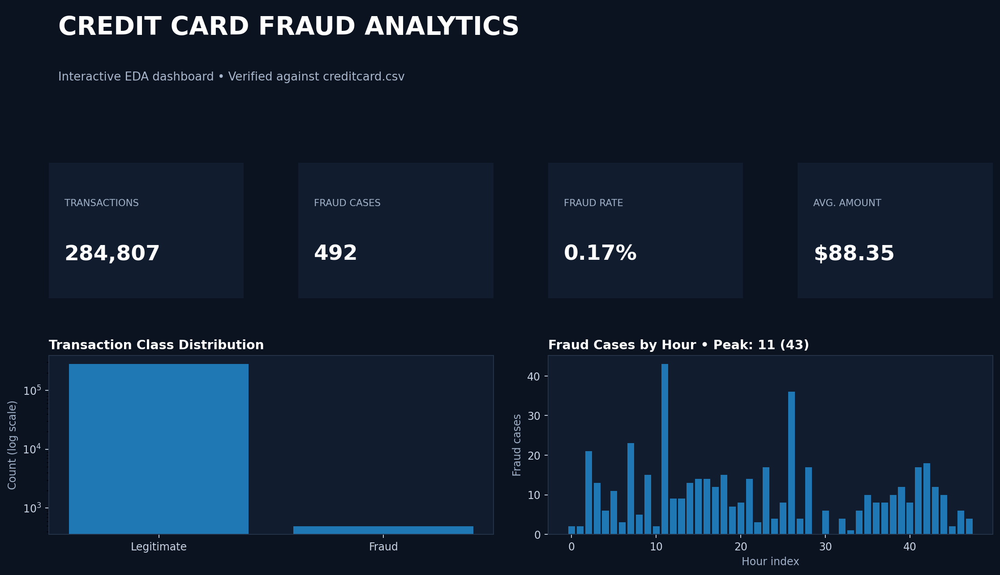

# Credit Card Fraud Detection — Exploratory Data Analysis

An end-to-end exploratory data analysis project focused on understanding credit card transaction behavior, severe class imbalance, transaction amounts, feature relationships, dimensionality reduction, anomaly detection, and fraud activity over time.

The project includes a cleaned and reproducible Jupyter Notebook, an interactive Streamlit dashboard, anomaly-oriented analysis using Isolation Forest, PCA visualization, data-quality checks, and a portfolio-ready project structure.

## Project Highlights

- Complete dataset with **284,807 transactions and 31 columns**
- No missing values in the supplied dataset
- Severe class imbalance analysis
- Transaction amount distribution and outlier analysis
- Corrected Z-score based outlier workflow
- Feature scaling using `StandardScaler`
- Correlation analysis across numeric variables
- PCA-based two-dimensional visualization
- `IsolationForest` anomaly detection
- Fraud activity analysis by time-derived hour
- Interactive Streamlit dashboard
- Filterable transaction exploration
- Reusable Jupyter Notebook
- GitHub-ready documentation and project structure

## Dataset

The project uses the supplied Credit Card Fraud Detection dataset.

- Local path: `data/creditcard.csv`
- Rows: **284,807**
- Columns: **31**
- Legitimate transactions: **284,315**
- Fraudulent transactions: **492**
- Fraud rate: **0.17%**
- Missing values: **0**
- Target variable: `Class`
- `Class = 0`: Legitimate transaction
- `Class = 1`: Fraudulent transaction

The `V1`–`V28` variables are anonymized numerical features. `Time` represents elapsed time, while `Amount` represents the transaction amount.

## Tech Stack

- Python
- Pandas
- NumPy
- Scikit-learn
- Matplotlib
- Seaborn
- Plotly
- Streamlit
- Jupyter Notebook

## Project Structure

    Exploratory-Data-Analysis-EDA/
    |-- data/
    |   |-- creditcard.csv
    |   `-- README.md
    |-- assets/
    |   `-- dashboard-preview.png
    |-- notebooks/
    |   `-- credit_card_fraud_eda_portfolio.ipynb
    |-- app.py
    |-- requirements.txt
    |-- .gitignore
    |-- LINKEDIN_POST.md
    `-- README.md

> The raw CSV is included locally for analysis but is excluded from Git by `.gitignore` by default. Check the dataset's redistribution terms before publishing the raw file publicly.

## Installation

Clone the repository and install the required dependencies:

    git clone https://github.com/nadeemahamad007/Exploratory-Data-Analysis-EDA---Associated-with-Hackveda-Solutions-Private-Limited-Internship.git
    cd Exploratory-Data-Analysis-EDA---Associated-with-Hackveda-Solutions-Private-Limited-Internship
    pip install -r requirements.txt

## Run the Notebook

Open:

    notebooks/credit_card_fraud_eda_portfolio.ipynb

The notebook covers data loading, validation, class imbalance, outlier analysis, feature distributions, correlation analysis, PCA, Isolation Forest, and time-based fraud exploration.

## Run the Dashboard

The project includes an interactive Streamlit dashboard.

    streamlit run app.py

The dashboard provides:

- Transaction and fraud KPIs
- Legitimate vs fraud distribution
- Transaction activity by hour
- Transaction amount distribution
- Fraud cases by hour
- Transaction type filtering
- Hour-range filtering
- Transaction amount filtering
- Filtered transaction preview

## Dashboard Preview

## EDA Workflow

1. Load and validate the transaction dataset
2. Inspect data types and missing values
3. Analyze the target class distribution
4. Examine transaction amounts and outliers
5. Apply standardized feature scaling
6. Explore feature distributions
7. Analyze feature correlations
8. Reduce dimensionality using PCA
9. Detect unusual observations using Isolation Forest
10. Analyze fraud activity using time-derived hour
11. Present key findings through an interactive dashboard

## Outlier Analysis

The original analysis used a Z-score approach for numerical outlier detection.

The upgraded notebook defines a row as an outlier when **at least one numerical feature has an absolute Z-score greater than 3**.

This avoids the overly restrictive behavior of requiring every numerical feature in a row to simultaneously exceed the threshold.

## PCA Analysis

PCA is used to project the high-dimensional transaction feature space into two principal components for visual exploration.

The PCA visualization is intended for exploratory understanding of the feature space and should not be interpreted as a production fraud classifier.

## Anomaly Detection

The project uses `IsolationForest` as an unsupervised anomaly-detection method.

The analysis uses:

    contamination=0.01
    n_estimators=200
    random_state=42

An anomaly detected by Isolation Forest is **not automatically a confirmed fraudulent transaction**. It is an unsupervised signal that can be investigated further.

## Key Findings

Based on the supplied dataset:

- The dataset contains **284,807 transactions**.
- Only **492 transactions are fraudulent**.
- Fraud represents approximately **0.17%** of all transactions.
- There are **no missing values**.
- Transaction amounts are highly variable, with a mean of approximately **$88.35** and a maximum of **$25,691.16**.
- The average transaction amount among the supplied fraud cases is approximately **$122.21**.
- Fraud cases can be explored across the dataset's time-derived hour index, with the highest observed fraud count occurring at hour index **11** in this dataset.

Because the target is severely imbalanced, future predictive modeling should not rely on accuracy alone.

## Model Evaluation Direction

This repository focuses on EDA and anomaly-oriented analysis rather than supervised model benchmarking.

For a future fraud-classification stage, appropriate evaluation should include:

- Precision
- Recall
- F1-score
- Precision-Recall AUC
- Confusion matrix
- Class-weighted or resampling strategies

## Current Limitation

The anonymized feature names limit direct business interpretation of individual `V1`–`V28` variables.

The extreme class imbalance also means that simple accuracy can be misleading.

Isolation Forest provides an anomaly signal but does not establish that an observation is fraudulent.

Therefore, this project should be considered an **EDA and machine-learning portfolio project**, not a production fraud-detection system.

## Future Improvements

- Build supervised fraud-classification models
- Compare Logistic Regression, Random Forest and other classifiers
- Handle class imbalance with class weighting or appropriate resampling
- Optimize decision thresholds
- Compare Precision, Recall, F1 and PR-AUC
- Add model explainability using SHAP
- Add interactive PCA/anomaly exploration
- Add richer dashboard filtering and downloadable reports
- Deploy the Streamlit dashboard
- Add automated model evaluation and experiment tracking

## Notebook

The main analysis is available in:

    notebooks/credit_card_fraud_eda_portfolio.ipynb

The reusable dashboard is available through:

    app.py

## Author

Nadeem Ahamad

Data Science Internship Project associated with **Hackveda Solutions Private Limited Internship**, focused on exploratory data analysis, credit card transaction analysis, fraud pattern investigation, anomaly detection, dimensionality reduction, and interactive visualization using Python, Pandas, Scikit-learn, and Streamlit.
